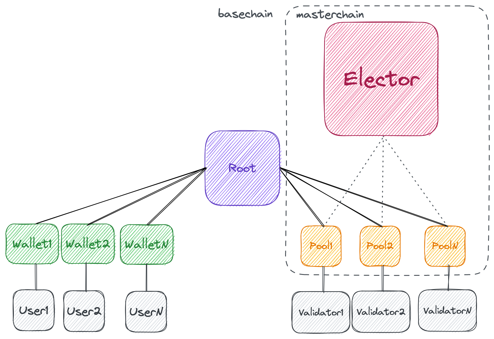
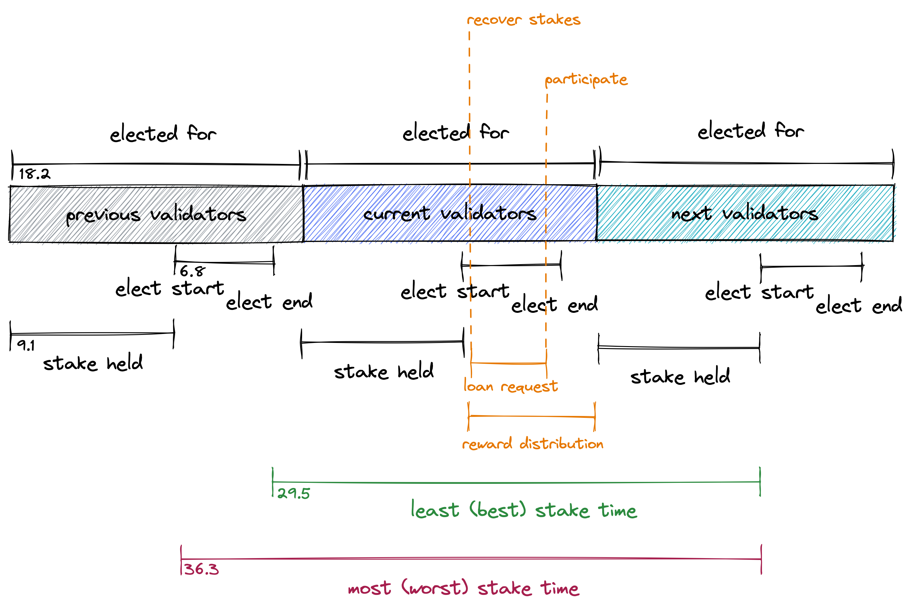

# Stake Hipo: hTON

Stake Hipo is a liquidity staking protocol on the TON blockchain. hTON is the jetton that users receive for staking their Toncoin.

## Highlights

- Automatic activation of hTON balance in wallets with zero messages or transactions.
- Protocol is driven by only 2 external messages, and gas fee is paid by Root itself.
- Participate external messages can only be accepted after at least one loan request.
- Recover external messages can only happen after round changes, and it can correct itself for prolonged rounds.
- Validators stake their hTON to receive a loan.
- Very little gas usage and storage on masterchain.
- Node operators can ask for loans with around 100 hTON.

### What Is Staking

BitCoin uses proof-of-work consensus. Miners should try to find a hash for the next block, and they have to use a lot of energy and spend a lot of money on mining hardware. For their hard work, they'll receive a block reward when they've found the hash.

TON uses a proof-of-stake consensus. Instead of spending a lot of money on energy and hardware equipment, validators (called miners in Bitcoin) just stake a big amount of TON, start producing blocks, and after a staking round, they'll receive their initial staked amount plus block rewards and collected fees. This has the advantage of not spending money on hardware and energy, and be honest or they'll get punished.

### What Is Liquid Staking

To be able to stake in the TON blockchain, you have to have a powerful server, a lot of TON (currently at least 300,000 TON), and lock access to your TON while staking.

Liquid staking helps here:

- Users who don't have a big amount of TON, can join their forces and share the result.

- System administrators can use cloud servers to validate blocks and earn an income, using TON that is staked by many users. They can't steal users' money and run. Users' TON is controlled by the protocol.

- Users who have staked their TON will receive a Jetton (token) called **hTON** which is 1-1 equal for their staked TON. They can send it to anyone, anytime they want, without having to wait for the lock period to end.

### How Much Is the Reward in TON

The TON blockchain has an inflation of %0.6 per year. This inflation, plus fees paid in each transaction is distributed between validators for their service of maintaining the network.

### High Level Overview

Users stake their TON using one of these options:

1. They can transfer any amount of TON to the `Root` smart contract of the protocol. This way, `Root` calculates the fees required for processing their request, subtracts it from the input amount, and then generates (mints) hTON and sends it to a special hTON `Wallet` for each user. Only the user has access to this wallet and only they can withdraw from it.

2. They can use the Stake tab of the protocols dApp (decentralized application) available at [https://stakehipo.com/app](https://stakehipo.com/app). This has the benefit that the user can enter the exact amount of hTON they want.

After this step, users have hTON and the protocol has TON. Now validators can come and ask for a TON loan. Loan requests are stored and at a specific time, all requests are checked, and the best ones that can return the most income will win. Winners will receive the requested TON in another smart contract called `Pool`.

This `Pool` automatically enters the election round that is ongoing on the blockchain by the `Elector` smart contract. If they win the election, then their related validator should validate blocks for the next round. After the round of validation ends, and after the punishment voting time has passed, `Pool` receives the staked amount plus its reward. Then `Pool` returns everything back to `Root`.

`Root` calculates validator's share and sends the equivalent hTON to validators `Wallet`. The rest of the amount is distributed between users.

From each user's wallet, a claim reward request must be sent to `Root`, which will then calculate the user's share and return the equivalent hTON.

This process continues for the next validation rounds. At some point, a user wants to transfer their hTON to another user. They can simply do a Jetton transfer from their wallet application.

At another point in time, users may want to redeem their hTON and receive TON. They can use the Unstake tab of the protocol's dApp. Now hTON is transferred from the user's `Wallet` to `Root`, which then releases TON to the user.

### Technical Details

In TON, protocols should avoid keeping a big table of data, and they have to be sharded. hTON is hence a sharded smart contract. There is one `Root` smart contract that receives TON and mints hTON and sends it to each user's `Wallet`. So there will be a lot of `Wallet` smart contracts, and each user's balance is kept in their `Wallet`. Validators send their loan request to `Root` too, and for each winner, a `Pool` smart contract will be created, which will participate in elections instead of validators.

`Elector` is a smart contract on the master chain which conducts elections. Here is how it works:

This image is drawn in [Excalidraw](https://excalidraw.com) and is editable over there.

Currently, each round of validation is around 18.2 hours, stake of validators is held for an additional 9.1 hours, elections start 9.1 hours before the end of round, elections end 2.2 hours before the end of round. Stakes are at least locked for 29.5 hours, and at worst 36.3 hours.

Since the new TON entering the system is not available for current validators, any newly staked amount is activated at a later time. When the stake time (when users stake their TON and receive hTON) is before the election begins, it will be activated beginning the next round. By activation we mean that hTON becomes transferrable and unstakeable. If it arrives after the election starts, it will be activated not at the next round, but at the later round, which is the round after next.

This mechanism helps prevent freeloaders from constantly staking and unstaking and receive the reward of the round and then quickly exit the protocol. So hTON is at least one round locked, but maybe two.

The process of activation is automatic with no messages or transactions required. When users check their balance using get methods, the current round is compared to the last saved round, and if it has changed, inactive balance becomes active, so there is no need for any messages or transactions. When users want to send some hTON, the same process happens again and inactive balance becomes active and usable.

At `recover stakes`, an external message is sent to `Root`. This message can be sent by anyone, but we also send it automatically at the correct time. If the time is right, `Root` asks old `Pool`s to recover their stake from `Elector` and return it to `Root`. This is a quick action and all `Pool`s participating in the previous round will retrieve their funds.

When the last `Pool` returns funds, total earned rewards are calculated, and then `Root` is ready to distribute rewards to users' `Wallet`s.

`Wallet`s have a `reward distribution` timespan to claim their reward share. An external message is sent to each `Wallet`. This message can be sent by anyone, but we also send it automatically at the correct time. If the time is right, `Wallet` sends a claim reward message to `Root`. Inside the message, `Wallet` includes all its active balance which is eligible for sharing the reward. `Root` receives this message, calculates the user's share, and adds it to the incoming active balance of the `Wallet` and returns it to the user. After this step, all users' `Wallet`s have received their reward share.

Validators can send a loan request in the `loan request` timespan. This timespan is around 90% of the election time. At `participate` time, `Root` will receive an external message which can be sent by anyone, but we also send it automatically.

`Root` will then decide on loan requests. Requests that are going to return the most reward will win. Any remaining TON amount in protocol is accrued between winners to increase the reward.

To prevent validators from draining the resources, a minimum payment can be set. This way validators who pay more will have more chances to win. If they waste the resources, they'll have to pay for it. For example, currently having less than 300,000 TON or more than 900,000 TON is rejected by `Elector`. Also there is a reward share parameter, which determines how the reward is shared between validators and protocol. Validators with lower shares have better chances.

There can be many winning `Pool`s, and the protocol supports even more than 255.

## Status

We wanted to participate in the [DoraHacks Hack-a-TONx](https://dorahacks.io/hackathon/hack-a-tonx/) competition. We had to release this first version described above, but there are some steps needed for a production ready version. These include:

- an upgrade mechanism
- a governance token to decide on the upgrade activation
- a mechanism to distribute rewards at later times to minimize network fees for wallets
- optimize gas usage
- update pre-calculated fee prices
- fork/update `mytonctrl` to be able to easily use hTON for validation
- add alternate pool functionality, so that validators can use the same wallet for two pools
- complete test suites to test different scenarios
- add an auto-unstake mechanism
- security audit
- bug bounty program

## Development

- Install dependencies: `yarn install`
- Build contracts: `yarn blueprint build`
- Deploy: `yarn blueprint run`
- Test: `yarn test --watch-all`

## License

MIT
